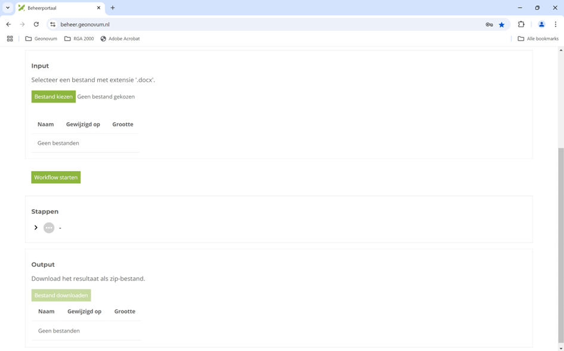

# Werken met workflows {#57409ED7}
## Opbouw van het beheerportaal {#6AE956A5}
Het beheerportaal staat op <a href='https://beheer.geonovum.nl' target='_blank'>https://beheer.geonovum.nl</a>. Voordat u kunt inloggen is het nodig dat Geonovum een account aanmaakt.
<figure id='d4e35'></img>
<figcaption>Inlogscherm van het beheerportaal</figcaption></figure>

Na inlog is er een overzicht van projecten.
<figure id='d4e72'></img>
<figcaption>Opbouw met een tegel-pagina</figcaption></figure>

De workflows voor het publiceren van documenten staan onder tegel ‘Algemeen’. Voor deze handleiding gaan we uit van de workflow ‘Werkversie’.
<figure id='d4e116'></img>
<figcaption>Weergave van de algemene workflows</figcaption></figure>

## Opbouw van een workflow-pagina {#069135D6}
De workflow-pagina bevat een link naar de repository ‘word2werkversie’. Hier kunt u het sjabloon respec.dotm downloaden.
<figure id='d4e168'></img>
<figcaption>Opbouw van een workflow-pagina</figcaption></figure>

De algemene gedachte achter een workflow is: ‘Je hebt een input, daar doe je wat mee en dan krijg je een output’. Een workflow is in het beheerportaal net zo opgebouwd:
<ul><li>‘Input’: Dit blok bevat een inlog-mogelijkheid.</li>
<li>‘Stappen’: Dit blok bevat alle stappen in de workflow.</li>
<li>‘Output’: Dit blok bevat het resultaat van de workflow.</li>
</ul>
 
 
Na voltooiing van de upload kunt u de workflow starten. Alle stappen worden uitgevoerd. Een groen vinkje geeft aan dat de stap is voltooid, een rood kruis geeft aan dat er wat mis is. Door op het pijlpuntje te klikken, krijgt u meer informatie.
<figure id='d4e244'></img>
<figcaption>Stappen in de workflow word2werkversie</figcaption></figure>

De workflow word2werkversie converteert een Word-bestand naar een ReSpec-werkversie en plaatst deze in een repository en maakt er een pages-versie van. Als bijproduct is het mogelijk om het resultaat te downloaden.
<figure id='d4e282'></img>
<figcaption>Output toont ook de inhoud van tekstdocumenten</figcaption></figure>

