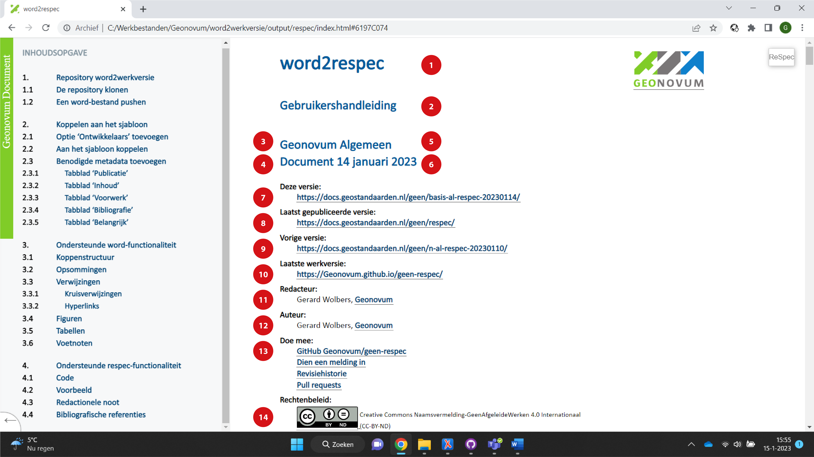
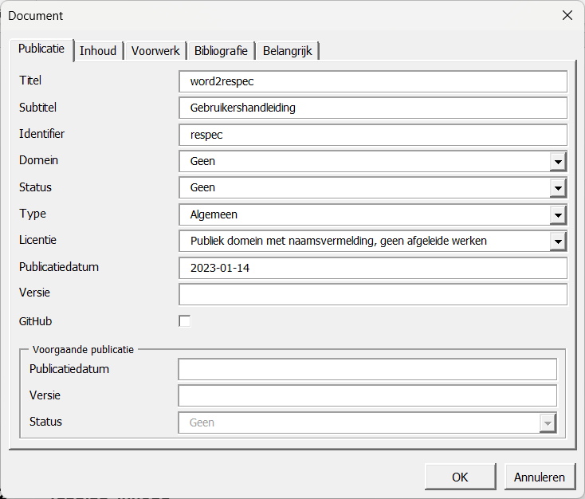
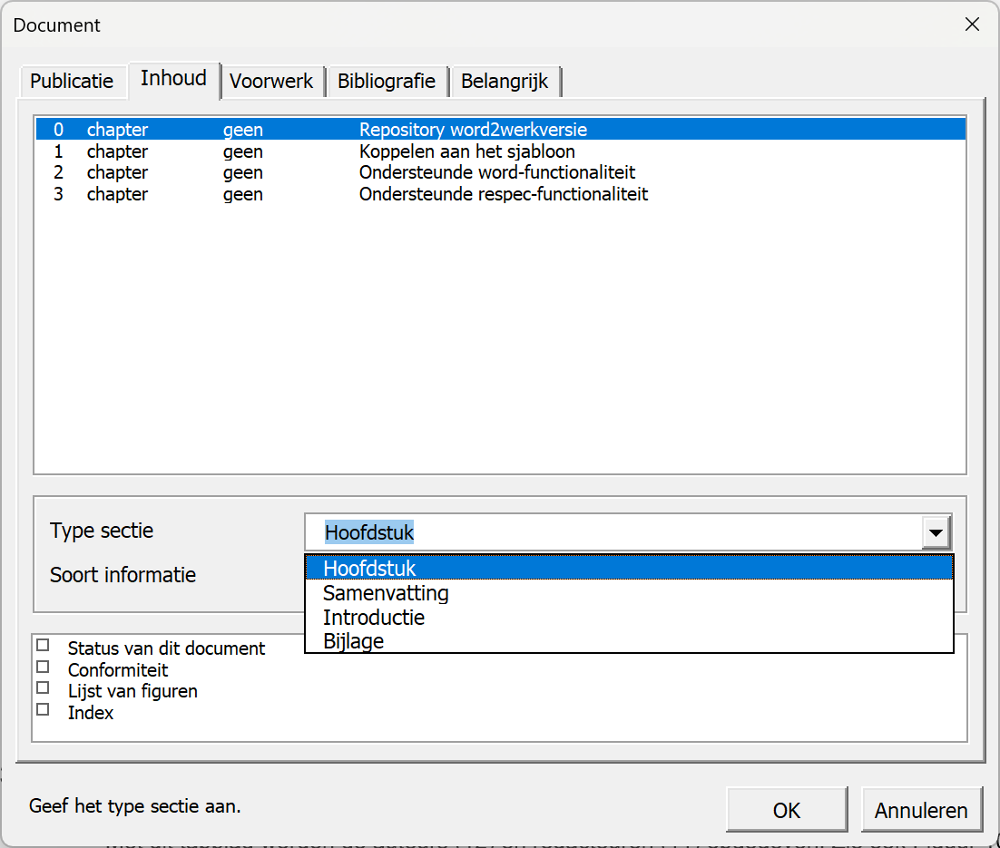
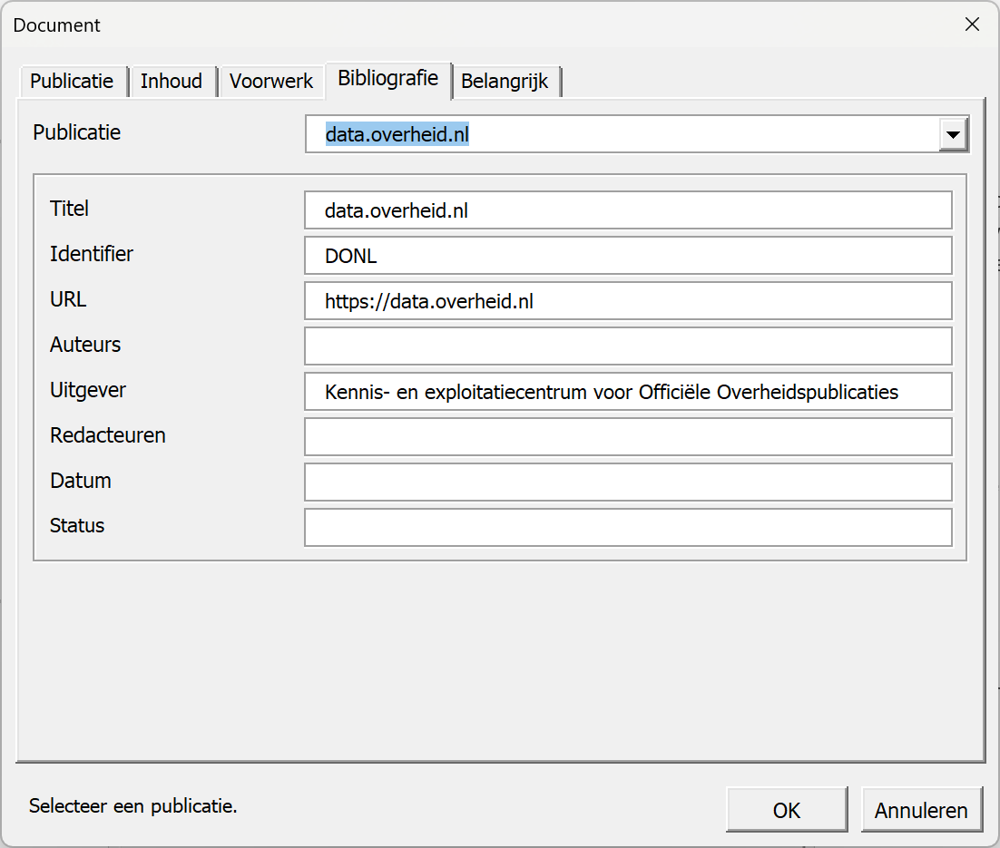
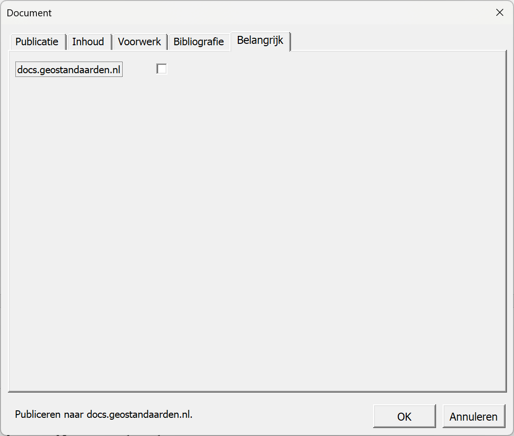

# Koppelen aan het sjabloon {#06895138}
## Sjabloon respec.dotm downloaden {#2D21C1C2}
Een bestaand Word-bestand moet gekoppeld worden aan sjabloon respec.dotm. Hiervoor zijn in Word verschillende stappen nodig.
<ol><li>Voeg aan het menu optie ‘Ontwikkelaars’ toe. Dit is een eenmalige handeling.</li>
<li>Koppel het Word-bestand aan het sjabloon.</li>
<li>Vul alle benodigde metadata in.</li>
</ol>
## Optie ‘Ontwikkelaars’ toevoegen {#6557F24B}
Standaard staat in Word de optie ‘Ontwikkelaars’ uit. Deze zet u aan bij menu-optie ‘Bestand’, ‘Opties’. Bij ‘Lint aanpassen’ vinkt u optie ‘Ontwikkelaars’ aan. Deze verschijnt dan in het menu.
<figure id='d4e377'></img>
<figcaption>Vink optie ‘Ontwikkelaars’ aan</figcaption></figure>

## Aan het sjabloon koppelen {#5C4981C0}
Bij menu-optie ‘Onwikkelaars’ ziet u in de werkbalk rechts de optie ‘Documentsjabloon’. Als u deze selecteert, krijgt u het volgende scherm.
<figure id='d4e426'></img>
<figcaption>Scherm ‘Sjablonen en invoegtoepassingen’</figcaption></figure>

Met ‘Bijvoegen’ selecteert u sjabloon respec.dotm in de map ‘input’ van uw lokale repository. Met de optie ‘Stijlen van het document automatisch bijwerken’ kunt u de stijlen in het document overschrijven door de stijlen in het sjabloon. Dit heeft voordelen omdat u daarmee automatische nummeringen in de koppenstructuur importeert, maar heeft als nadeel dat uw vormgeving waarschijnlijk wijzigt.
Nadat u het document heeft gekoppeld aan het sjabloon zijn er twee belangrijke aanpassingen:
<ul><li>Er verschijnt een nieuwe menu-optie ‘Respec’.</li>
<li>De optie ‘Plakken’ voegt alleen nog niet-opgemaakte Unicode-tekst toe. U kunt dit omzeilen met de optie ‘Plakken speciaal’ (Alt+Ctrl+V). Hiermee kunt u opgemaakte tekst toevoegen.</li>
</ul>
## Benodigde metadata toevoegen {#6197C074}
Om het Word-bestand goed te kunnen transformeren naar een nieuwe ReSpec-werkversie moet u metadata meegeven. Hiervoor heeft de respec-werkbalk links de optie ‘Document’.
<figure id='d4e501'></img>
<figcaption>Het voorblad wordt ‘gevoed’ vanuit scherm ‘Document’</figcaption></figure>

### Tabblad ‘Publicatie’ {#36478F31}
Voor de publicatie zijn onderstaande gegevens van belang (zie <a href='#d4e501'>Figuur 9</a>).
<ul><li>‘Titel’ (1) wordt gebruikt in het voorwerk van de publicatie.</li>
<li>‘Subtitel’ (2) is optioneel.</li>
<li>‘Omschrijving’ is optioneel maar wel belangrijk voor ‘Search Engine Optimization’ (SEO). Bij zoekmachines komt de omschrijving onder de zoekresultaten te staan. Het maximale aantal lettertekens is 150.</li>
<li>‘Identifier’ wordt gebruikt in verschillende url’s. Als de identifier is weggelaten wordt er een uri-bestendige variant van de titel als identifier gebruikt.</li>
<li>‘Domein’ verwijst naar het project. In dit geval is er geen domein. Het domein is heel belangrijk in de opbouw van de url’s.</li>
<li>‘Status’ (4) van het document geeft aan in welk stadium de publicatie is.</li>
<li>‘Type’ (5) geeft het type publicatie aan.</li>
<li>‘Licentie’ (14) geeft aan onder welke licentie het document wordt gepubliceerd.</li>
<li>‘Publicatiedatum’ (7) wordt gebruikt als versie-aanduiding in de url.</li>
<li>‘Voorgaande publicatiedatum’ (9) wordt gebruikt als versie-aanduiding in de url van de vorige versie. Als deze wordt weggelaten, dan wordt ‘Vorige versie’ niet getoond.</li>
<li>‘Status’ van de voorgaande publicatie wordt gebruikt om de url samen te stellen.</li>
<li>‘GitHub’ geeft aan of het blok ‘Doe mee’ (13) wordt getoond.</li>
</ul>
<figure id='d4e670'></img>
<figcaption>Tabblad ‘Publicatie’</figcaption></figure>

### Tabblad ‘Inhoud’ {#1DA7B3C6}
Respec heeft meer informatie nodig over de opbouw van de publicatie. Op basis hiervan verandert de werking. In het scherm worden alle hoofdstukken opgesomd. Voorwaarde is wel dat de koppenstructuur (zie <a href='#2E987008'>3.1</a>) met stijl ‘Kop 1’ is aangegeven. Respec zet dit om naar html-secties. Van elke sectie kunnen we op het hoogste niveau het type en het soort informatie opgeven.
<ul><li>Het type sectie geeft aan of het voorwerk of een bijlage is. Bij optie ‘Voorwerk’ wordt het weggelaten uit de inhoudsopgave. De koppen krijgen in de publicatie geen nummering. Bij optie ‘Bijlage’ wordt de nummering met kapitale letters aangegeven.</li>
<li>Bij het soort informatie is er één optie ‘Informatief’. Als de optie wordt weggelaten, ziet ReSpec het als normatieve informatie. Als een sectie wordt gemarkeerd als informatief, dan wordt onder de kop de tekst ‘Dit onderdeel is niet normatief’ weergegeven. Daarnaast worden bibliografische verwijzingen (zie <a href='#d4e1964'>Figuur 23</a>) aangegeven als ‘Informatieve referenties’.</li>
</ul>
 
 
Respec kan ook specifieke informatie toevoegen. U kunt deze aanvinken.
<figure id='d4e768'></img>
<figcaption>Tabblad ‘Inhoud’</figcaption></figure>

### Tabblad ‘Voorwerk’ {#59427DAE}
Met dit tabblad worden de auteurs (12) en redacteuren (11) opgegeven. Zie ook <a href='#d4e501'>Figuur 9</a> voor de nummering. Er is minimaal één redacteur nodig, auteurs zijn optioneel. U voegt een auteur of redacteur toe met optie ‘Nieuw’. Vul daarna naam, bedrijfsnaam en url van het bedrijf in. De url moet volledig zijn, dus inclusief ‘https://’. Als u een auteur of redacteur wilt verwijderen, selecteert u de desbetreffende naam en maakt u veld ‘Naam’ leeg.
<figure id='d4e830'></img>
<figcaption>Tabblad ‘Voorwerk’</figcaption></figure>

### Tabblad ‘Bibliografie’ {#47906F38}
Respec ondersteunt bibliografische referenties (zie <a href='#4083BE20'>4.6</a>). U kunt deze opgeven met tabblad ‘Bibliografie’. U voegt een publicatie toe met optie ‘Nieuw’. Vul daarna de onderstaande velden in. Alle velden zijn optioneel behalve veld ‘Titel’. Als u een publicatie wilt verwijderen, selecteert u de desbetreffende titel en maakt u veld ‘Titel’ leeg.
<figure id='d4e895'></img>
<figcaption>Tabblad ‘Bibliografie’</figcaption></figure>

Het is wel belangrijk om de identifier op te nemen omdat hiermee in de tekst wordt verwezen naar de bibliografische bron (zie <a href='#4083BE20'>4.6</a>).
### Tabblad ‘Belangrijk’ {#01606068}
Dit tabblad is voor de workflow word2werkversie niet van belang. De workflow word2publicatie gebruikt het om de definitieve publicatie op de server docs.geostandaarden.nl te plaatsen. In andere gevallen wordt de test-omgeving test.docs.geostandaarden.nl gebruikt.
<figure id='d4e963'></img>
<figcaption>Tabblad ‘Belangrijk’</figcaption></figure>

