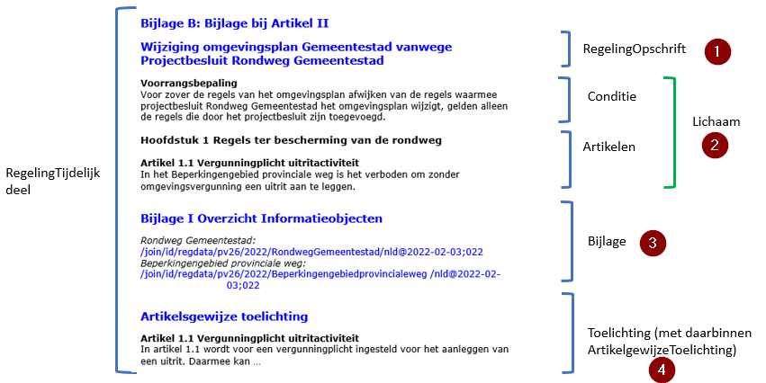
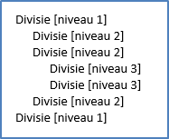
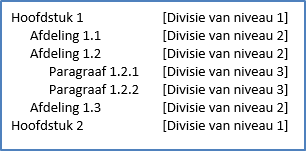
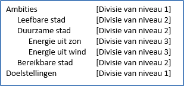
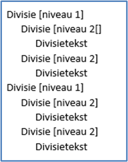
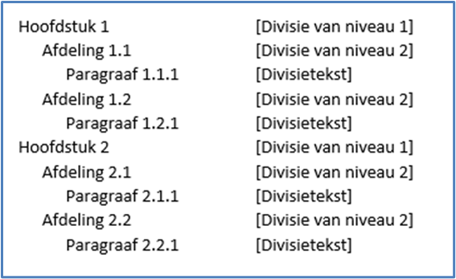

# Ondersteunde Word-functionaliteit {#2E63D1F3}
## Koppenstructuur {#2E987008}
Alle transformaties in de word2respec-workflow zijn gebaseerd op het gebruik van de stijlen ‘Kop 1’ t/m ‘Kop 9’. Overigens biedt dit veel extra mogelijkheden binnen Word. Het venster ‘Stijlen’ opent (en sluit) u met toetscombinatie Alt+Ctrl-Shift+S.
<figure id='d4e1028'></img>
<figcaption>Navigatie op basis van de koppenstructuur</figcaption></figure>

## Opsommingen {#10DDDABF}
Er zijn twee typen opsommingen, genummerd en met tekens. Hiervoor dient u de Word-functie ‘Opsommingen’ te gebruiken. De opsommingen mogen gedefinieerd zijn in de stijl. De opsomming wordt omgezet naar opsommingen zoals ze voor het specifieke domein zijn gedefinieerd in het css-bestand. Dus het is mogelijk dat een opsomming met kapitale letters wordt omgezet naar Romeinse cijfers.
## Verwijzingen {#15D453C9}
Omdat de koppenstructuur, figuurnummers en tabelnummers worden gegenereerd door ReSpec, is het niet verstandig om verwijzingen als tekst op te nemen. Dit kan op twee manieren:
<ul><li>met kruisverwijzingen,</li>
<li>met interne verwijzingen.</li>
</ul>
### Kruisverwijzingen {#44411ED5}
Hiervoor gebruikt u de Word-functie ‘Kruisverwijzing’ (Alt+Ctrl+Shift+K). Hiermee kunt u verwijzen naar alle mogelijke genummerde alinea’s.
<figure id='d4e1129'></img>
<figcaption>Scherm ‘Kruisverwijzing’</figcaption></figure>

<figure id='d4e1162'></img>
<figcaption>Weergave van een kruiskoppeling in ReSpec</figcaption></figure>

### Hyperlinks {#0A825EF3}
Ook hyperlinks worden doorgegeven in de ReSpec-weergave. Met scherm ‘Hyperlink invoegen’ (Ctrl+K) voegt u een hyperlink toe, bijvoorbeeld naar hoofdstuk Repository word2werkversie.
<figure id='d4e1218'></img>
<figcaption>Scherm voor het invoegen en bewerken van hyperlinks</figcaption></figure>

<figure id='d4e1251'></img>
<figcaption>Weergave van een hyperlink in ReSpec</figcaption></figure>

## Figuren {#27284A38}
Het veiligst is om figuren met tekstomloop ‘In tekstregel’ te gebruiken. De transformatie moet namelijk weten waar in de tekst een figuur ‘verankerd’ is. Dit is in Word de standaard-mogelijkheid voor het plaatsen van figuren. De omvang van een figuur wordt berekend aan de hand van de breedte. De verhouding tussen de figuurbreedte en tekstbreedte wordt gebruikt in de uiteindelijke ReSpec-weergave. Als de figuurbreedte meer dan 90% van de tekstbreedte is, wordt het uitgevuld naar de volledige tekstbreedte.
 
 
Het is mogelijk om met kruisverwijzingen (zie <a href='#44411ED5'>3.3.1</a>) te verwijzen naar een figuur. De alinea onder de figuur wordt omgezet naar een figuurbijschrift als u het markeert met stijl ‘Figuurbijschrift’ of ‘Bijschrift’.
## Tabellen {#4FB3FFF7}
Tabellen worden volledig door de workflow word2respec ondersteund:
<ul><li>Tabelstijlen en tabeleigenschappen worden ondersteund.</li>
<li>De celopmaak wordt overgenomen.</li>
<li>Kolombreedte wordt overgenomen.</li>
<li>Samengevoegde cellen verticaal en horizontaal worden ondersteund.</li>
</ul>
 
 
Als u de alinea boven de tabel (zie <a href='#d4e1391'>Tabel 1</a>) markeert met stijl ‘Tabeltitel’ of ‘Bijschrift’, dan wordt de alinea verwerkt als tabeltitel. In de tekst kunt u verwijzen naar de tabeltitel (zie <a href='#44411ED5'>3.3.1</a>). Merk op dat ReSpec in de weergave de tabeltitel niet weergeeft met een nummering. Onderstaand is een voorbeeldtekst.
<table id='d4e1391' style='width: 100%;'><caption>Vergelijking met huidige rechtsfiguren en RO Standaarden</caption>
<colgroup><col id='col1' style='width: 35.00117730162467%;'>
<col id='col2' style='width: 64.99882269837532%;'>
</colgroup>
<thead><tr><th class='left' style='border-top: 0.5pt solid #BFBFBF; border-left: 0.5pt solid #BFBFBF; border-bottom: 0.5pt solid #BFBFBF; border-right: 0.5pt solid #BFBFBF;'>
Onderwerp
</th>
<th class='left' style='border-top: 0.5pt solid #BFBFBF; border-left: 0.5pt solid #BFBFBF; border-bottom: 0.5pt solid #BFBFBF; border-right: 0.5pt solid #BFBFBF;'>
Specificatie
</th>
</tr>
</thead>
<tbody><tr><td class='left' style='border-top: 0.5pt solid #BFBFBF; border-left: 0.5pt solid #BFBFBF; border-bottom: 0.5pt solid #BFBFBF; border-right: 0.5pt solid #BFBFBF;'>
Vergelijkbaar met / voortzetting van huidige rechtsfiguur
</td>
<td class='left' style='border-top: 0.5pt solid #BFBFBF; border-left: 0.5pt solid #BFBFBF; border-bottom: 0.5pt solid #BFBFBF; border-right: 0.5pt solid #BFBFBF;'><ul><li>bestemmingsplan, uitwerkingsplan, wijzigingsplan en inpassingsplan op basis van Wro</li>
<li>beheersverordening op basis van Wro</li>
<li>bestemmingsplan met verbrede reikwijdte op basis van Crisis- en herstelwet</li>
<li>welstandsnota op basis van Woningwet</li>
<li>erfgoedverordening op basis van Monumentenwet</li>
<li>algemene plaatselijke verordening op basis van Gemeentewet</li>
<li>…</li>
</ul>
</td>
</tr>
<tr><td class='left' style='border-top: 0.5pt solid #BFBFBF; border-left: 0.5pt solid #BFBFBF; border-bottom: 0.5pt solid #BFBFBF; border-right: 0.5pt solid #BFBFBF;'>
Voortzetting van instrument in RO Standaarden
</td>
<td class='left' style='border-top: 0.5pt solid #BFBFBF; border-left: 0.5pt solid #BFBFBF; border-bottom: 0.5pt solid #BFBFBF; border-right: 0.5pt solid #BFBFBF;'>
Ja, bestemmingsplan en beheersverordening
</td>
</tr>
<tr><td class='left' style='border-top: 0.5pt solid #BFBFBF; border-left: 0.5pt solid #BFBFBF; border-bottom: 0.5pt solid #BFBFBF; border-right: 0.5pt solid #BFBFBF;'>
INSPIRE-thema
</td>
<td class='left' style='border-top: 0.5pt solid #BFBFBF; border-left: 0.5pt solid #BFBFBF; border-bottom: 0.5pt solid #BFBFBF; border-right: 0.5pt solid #BFBFBF;'>
Planned Land Use: SpatialPlan
</td>
</tr>
</tbody>
</table>

## Voetnoten {#476F745B}
De transformatie ondersteunt niet-complexe voetnoten. Onderstaand is een voorbeeldtekst.
 
 
Op grond van artikel 20.26 lid 2 Omgevingswet worden besluiten en andere rechtsfiguren op grond van die wet die bij ministeriële regeling zijn aangeduid als omgevingsdocument, ontsloten via DSO-LV. De bedoelde ministeriële regeling is de Regeling standaarden publicaties Omgevingswet[1] De Regeling standaarden publicaties Omgevingswet is een ministeriële regeling bij de Bekendmakingswet 
. Deze regeling wijst besluiten en andere rechtsfiguren aan als omgevingsdocument en stelt het verplicht om die omgevingsdocumenten, en ontwerpen daarvan, elektronisch vorm te geven conform de Standaard voor Officiële Publicaties, het InformatieModel Omgevingswet en het voor het betreffende omgevingsdocument voorgeschreven toepassingsprofiel. Ook bevat deze regeling de verplichting om omgevingsdocumenten voor publicatie aan te bieden aan het Bronhouderkoppelvlak van de LVBB.
<figure id='d4e1563'></img>
<figcaption>Respec-weergave van een voetnoot</figcaption></figure>

