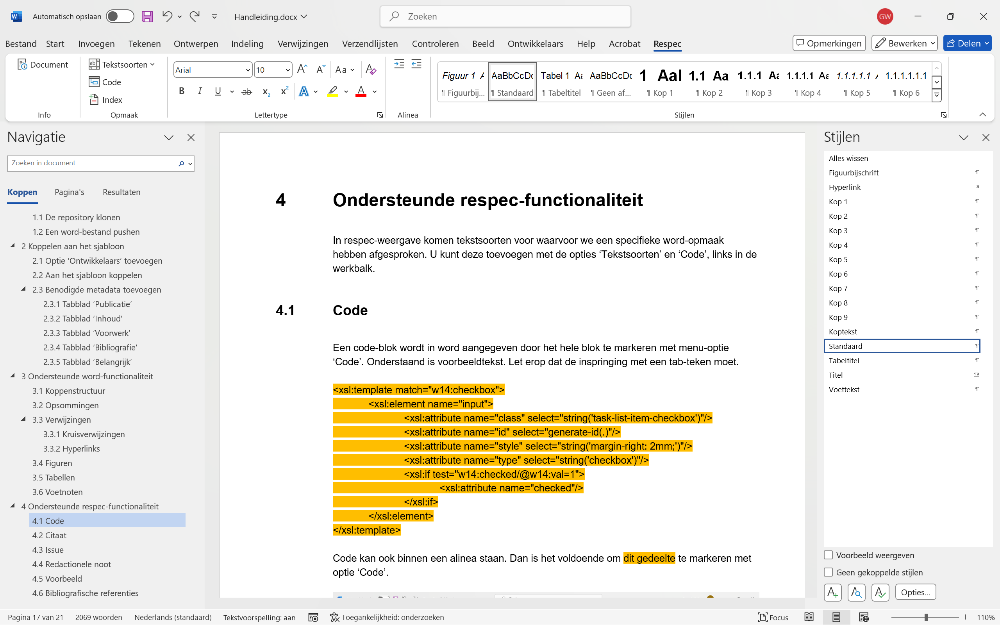
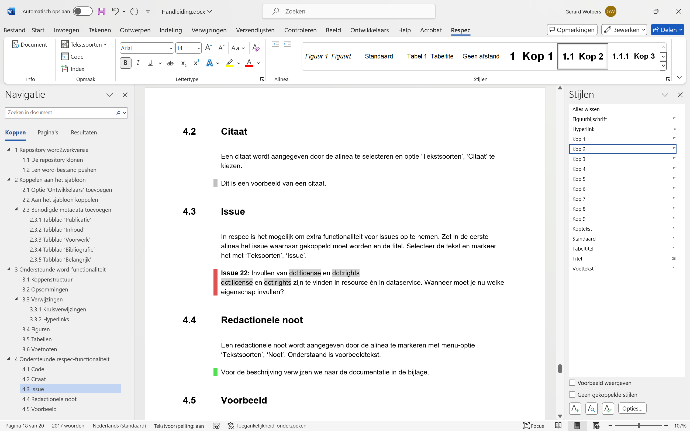
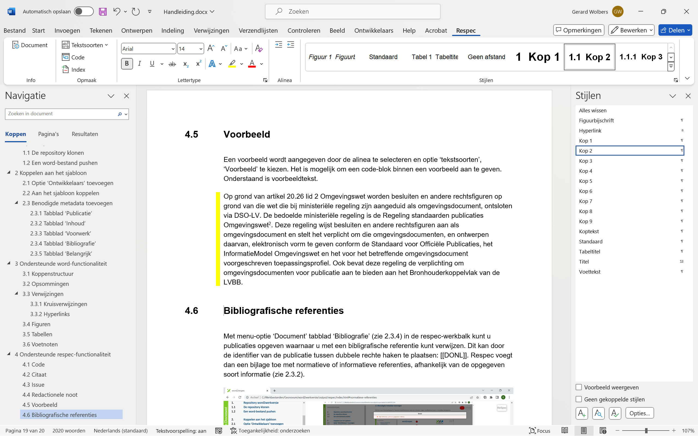
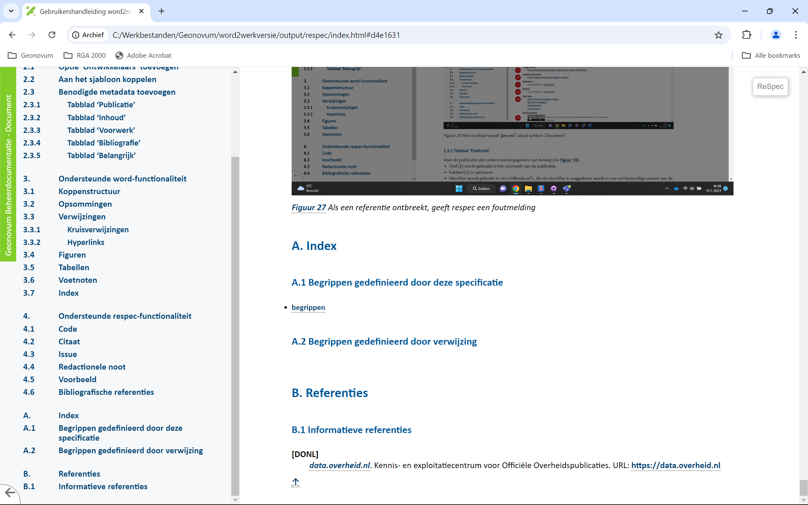

# Ondersteunde ReSpec-functionaliteit {#15D08FC1}
In ReSpec-weergave komen tekstsoorten voor waarvoor we een specifieke Word-opmaak hebben afgesproken. U kunt deze toevoegen met de opties ‘Tekstsoorten’ en ‘Code’, links in de werkbalk.
## Code {#692AB1A3}
Een code-blok wordt in Word aangegeven door het hele blok te markeren met menu-optie ‘Code’. Onderstaand is voorbeeldtekst. Let erop dat de inspringing met een tab-teken moet.
 
 
<pre class="text">&lt;xsl:template match="w14:checkbox"&gt;    &lt;xsl:element name="input"&gt;        &lt;xsl:attribute name="class" select="string('task-list-item-checkbox')"/&gt;        &lt;xsl:attribute name="id" select="generate-id(.)"/&gt;        &lt;xsl:attribute name="style" select="string('margin-right: 2mm;')"/&gt;        &lt;xsl:attribute name="type" select="string('checkbox')"/&gt;        &lt;xsl:if test="w14:checked/@w14:val=1"&gt;            &lt;xsl:attribute name="checked"/&gt;        &lt;/xsl:if&gt;    &lt;/xsl:element&gt;&lt;/xsl:template&gt;</pre>

 
 
Code kan ook binnen een alinea staan. Dan is het voldoende om <code>dit gedeelte</code> te markeren met optie ‘Code’.
<figure id='d4e1760'></img>
<figcaption>Voorbeeld van een code-blok in Word</figcaption></figure>

## Citaat {#47C7E86B}
Een citaat wordt aangegeven door de alinea te selecteren en optie ‘Tekstsoorten’, ‘Citaat’ te kiezen.
<blockquote>
Dit is een voorbeeld van een citaat.
</blockquote>

<figure id='d4e1819'></img>
<figcaption>Weergave van tekstsoorten ‘Citaat’, ‘Issue’ en ‘Noot’ in Word</figcaption></figure>

## Issue {#0E8A6FC9}
In ReSpec is het mogelijk om extra functionaliteit voor issues op te nemen. Zet in de eerste alinea het issue waarnaar gekoppeld moet worden en de titel. Selecteer de tekst en markeer het met ‘Teksoorten’, ‘Issue’.
<aside class='issue'>
<b>Issue 22</b>: Invullen van <code>dct:license</code> en <code>dct:rights</code>

<code>dct:license</code> en <code>dct:rights</code> zijn te vinden in resource én in dataservice. Wanneer moet je nu welke eigenschap invullen?
</aside>

## Redactionele noot {#774275FA}
Een redactionele noot wordt aangegeven door de alinea te markeren met menu-optie ‘Tekstsoorten’, ‘Noot’. Onderstaand is voorbeeldtekst.
<aside class='note'>
Voor de beschrijving verwijzen we naar de documentatie in de bijlage.
</aside>

## Voorbeeld {#13F17295}
Een voorbeeld wordt aangegeven door de alinea te selecteren en optie ‘tekstsoorten’, ‘Voorbeeld’ te kiezen. Het is mogelijk om een code-blok binnen een voorbeeld aan te geven. Onderstaand is voorbeeldtekst.
<aside class='example'>
Op grond van artikel 20.26 lid 2 Omgevingswet worden besluiten en andere rechtsfiguren op grond van die wet die bij ministeriële regeling zijn aangeduid als omgevingsdocument, ontsloten via DSO-LV. De bedoelde ministeriële regeling is de Regeling standaarden publicaties Omgevingswet[2] De Regeling standaarden publicaties Omgevingswet is een ministeriële regeling bij de Bekendmakingswet 
. Deze regeling wijst besluiten en andere rechtsfiguren aan als omgevingsdocument en stelt het verplicht om die omgevingsdocumenten, en ontwerpen daarvan, elektronisch vorm te geven conform de Standaard voor Officiële Publicaties, het InformatieModel Omgevingswet en het voor het betreffende omgevingsdocument voorgeschreven toepassingsprofiel. Ook bevat deze regeling de verplichting om omgevingsdocumenten voor publicatie aan te bieden aan het Bronhouderkoppelvlak van de LVBB.
</aside>

<figure id='d4e1964'></img>
<figcaption>Voorbeeld van een voorbeeld in Word</figcaption></figure>

## Bibliografische referenties {#4083BE20}
Met menu-optie ‘Document’ tabblad ‘Bibliografie’ (zie <a href='#47906F38'>2.4.4</a>) in de respec-werkbalk kunt u publicaties opgeven waarnaar u met een bibliografische referentie kunt verwijzen. Dit kan door de identifier van de publicatie tussen dubbele rechte haken te plaatsen: [[DONL]]. Respec voegt dan een bijlage toe met normatieve of informatieve referenties, afhankelijk van de opgegeven soort informatie (zie <a href='#1DA7B3C6'>2.4.2</a>).
<figure id='d4e2042'></img>
<figcaption>Bijlage met normatieve referenties</figcaption></figure>

<figure id='d4e2075'></img>
<figcaption>Als een referentie ontbreekt, geeft ReSpec een foutmelding</figcaption></figure>

## Index {#248D2221}
De transformatie ondersteunt het toevoegen van een index (zie <a href='#1DA7B3C6'>2.4.2</a>). Met behulp van menu-optie ‘Index’ kunt u <dfn class='index-term' id='d4e2126'>begrippen</dfn> opnemen die in het register worden opgenomen.
<figure id='d4e2139'></img>
<figcaption>Weergave van een index-markering in Word</figcaption></figure>

<figure id='d4e2181'></img>
<figcaption>Respec-weergave van de index</figcaption></figure>

